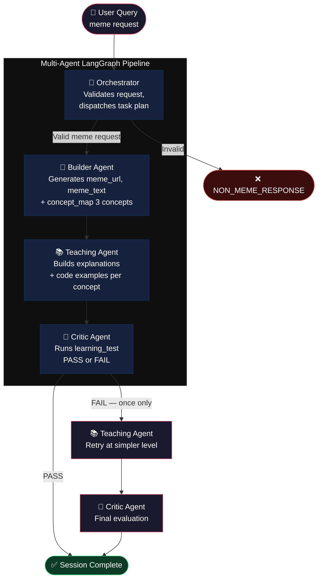
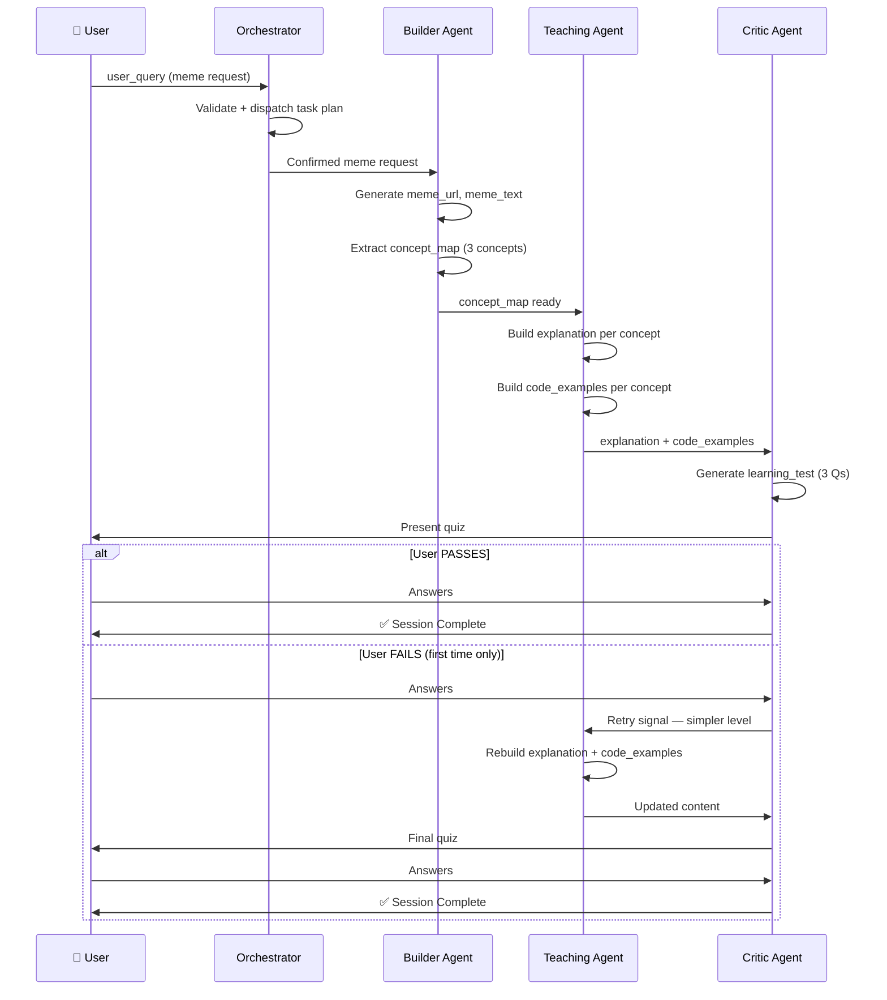

# 🧠 ignitio-ai-tutor — Backend

> **Amazon Nova AI Hackathon** · Best Student App Category  
> An AI-powered LangChain learning engine built on a multi-agent LangGraph pipeline, driven by Amazon Nova models.

---

## What It Does

ignitio-ai-tutor flips how people learn AI frameworks. Instead of reading docs first, you throw a meme idea at it. The system builds the meme using real LangChain code, reverse-engineers the 3 key concepts it just used, teaches you those concepts in context, and then quizzes you to lock it in.

**Tinker first. Learn second.**

---

## Architecture Overview



---

## State Machine — Data Flow

Every piece of data that flows through the graph lives in a single typed state object. No agent touches data it doesn't own. No field is populated before it's earned.



---

## Tech Stack

| Layer | Technology | Why |
|---|---|---|
| Language | Python ≥ 3.14 | Modern, clean async support |
| Package Manager | `uv` | 10-100x faster than pip |
| LLM Framework | LangChain + LangChain Core | Industry-standard agent primitives |
| Graph / Orchestration | LangGraph | State machine with conditional routing |
| LLM — Builder & Teaching | **Amazon Nova Pro** | High-quality generation for content accuracy |
| LLM — Critic | **Amazon Nova Lite** | Speed + cost-efficiency for evaluation |
| Data Validation | Pydantic v2 | Strict typed state schema |
| Environment Config | `python-dotenv` | Secure secrets management |

---

## Project Structure

```
ignitio-ai-tutor/
├── core/
│   └── llm.py                  # 🔑 All LLM initialisation — Nova Pro + Nova Lite
├── graph/
│   ├── builder.py              # 🗺️ Graph topology, edges, conditional routing
│   └── state.py                # 📋 graph_state schema — single source of truth
├── nodes/
│   ├── orchestrator/
│   │   ├── node.py             # Validation + task dispatch logic
│   │   └── prompt.py           # Orchestrator prompt template
│   ├── builder/
│   │   ├── node.py             # Meme + concept_map generation
│   │   └── prompt.py           # Builder prompt template
│   ├── teaching/
│   │   ├── node.py             # Explanation + code_examples generation
│   │   └── prompt.py           # Teaching prompt template
│   └── critic/
│       ├── node.py             # Learning test + pass/fail evaluation
│       └── prompt.py           # Critic prompt template
├── main.py                     # 🚀 Entry point
├── pyproject.toml
├── uv.lock
├── .env.example
└── CLAUDE.md
```

---

## Graph State Schema

The entire session's data lives in one typed Pydantic model. Every agent reads from and writes to this shared state — no loose variables, no hidden dependencies.

```python
class graph_state(BaseModel):
    user_query: str       # Raw input from the user
    meme_url: str         # URL of the generated meme image
    meme_text: str        # Top/bottom text used in the meme
    concept_map: dict     # 3 LangChain concepts extracted from meme generation
    explanation: dict     # Per-concept educational explanation (Teaching agent)
    code_examples: dict   # Per-concept LangChain code snippet (Teaching agent)
    learning_test: dict   # 3-question quiz + evaluation (Critic agent)
    retry_count: int      # Loop guard — Critic→Teaching retry capped at 1
```

> `retry_count` is the hard guard on the reflection loop. The graph's conditional edge in `graph/builder.py` checks this before routing back to Teaching — the loop **never runs more than once**.

---

## Key Design Decisions

### Why LangGraph over a simple chain?

A linear chain can't handle conditional branching. The Critic's pass/fail decision needs to route back to Teaching exactly once, then force-exit. LangGraph's state machine makes this enforced, inspectable, and debuggable — not a hacky `while` loop.

### Why Nova Pro for Builder/Teaching, Nova Lite for Critic?

The Builder and Teaching agents need high accuracy — they're generating educational content that has to be correct. Nova Lite is fast and cheap enough for the Critic's binary evaluation task (pass/fail). This keeps costs low without sacrificing quality on the content that matters.

### Why `uv` over pip/poetry?

Dependency resolution is dramatically faster. On a cold machine with no cache, `uv sync` completes in seconds. For a hackathon demo with judges watching, that matters.

### Why prompt isolation in `prompt.py`?

Keeps node logic clean and testable. A node's `.py` file handles data wiring; the `.prompt.py` handles what the LLM sees. You can iterate on prompts without touching graph logic, and vice versa.

---

## Setup & Run

### Prerequisites

- Python ≥ 3.14
- [`uv`](https://docs.astral.sh/uv/getting-started/installation/) installed

### Install

```bash
# Clone the repo
git clone <backend-repo-url>
cd ignitio-ai-tutor

# Install dependencies (fast)
uv sync

# Activate virtual environment
source .venv/bin/activate       # macOS/Linux
.venv\Scripts\activate          # Windows

# Set up environment variables
cp .env.example .env
# Fill in your AWS / Amazon Bedrock credentials in .env
```

### Environment Variables

```env
AWS_ACCESS_KEY_ID=...
AWS_SECRET_ACCESS_KEY=...
AWS_REGION=us-east-1
# Add any other provider keys as needed
```

### Run

```bash
uv run main.py
```

---

## Agent Responsibilities — Quick Reference

| Agent | Runs | Input | Output |
|---|---|---|---|
| **Orchestrator** | Once at start | `user_query` | Task plan or `NON_MEME_RESPONSE` |
| **Builder** | Once | `user_query` (validated) | `meme_url`, `meme_text`, `concept_map` |
| **Teaching** | 1–2× (retry gated) | `concept_map` | `explanation`, `code_examples` |
| **Critic** | 1–2× (after each Teaching run) | `explanation`, `code_examples` | `learning_test`, pass/fail |

---

## Hackathon Context

Built for the **Amazon Nova AI Hackathon** — targeting the **Best Student App** category.

The architecture demonstrates:
- **Multi-agent orchestration** with LangGraph state machines
- **Amazon Nova model selection** (Pro vs Lite) based on task complexity
- **Reflection loop pattern** — a production-grade agentic pattern with a hard loop cap
- **Tinker-first pedagogy** — a novel approach to teaching developer tools

---

## Frontend

The Next.js frontend repo lives here: **[→ Frontend Repository](https://github.com/gurwnx222/ignitio-ai-frontend)**

It connects to this backend via three API proxy routes — `/api/course`, `/api/code-lesson`, and `/api/quiz` — mapping directly to the Builder, Teaching, and Critic agent outputs.
